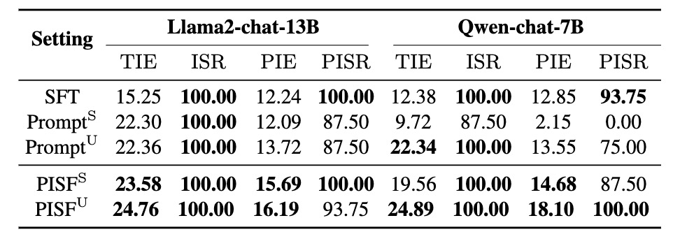

# Extroversion or Introversion? Controlling The Personality of Your Large Language Models

Authors: Yanquan Chen, Zhen Wu, Junjie Guo, Shujian Huang, Xinyu Dai

## Overview

We embarked on a comprehensive investigation into personality control with typical methods to influence LLMs. Based on the exploration findings, we proposed Prompt Induction post Supervised Fine-tuning (PISF), which emerges as the most effective and robust strategy for controlling LLMs' personality, displaying high efficacy, high success rates, and high robustness.


## Codes

All codes and scripts for Continual Pre-train, Supervised Fine-tuning (SFT), and Reinforcement Learning with Human Feedback (RLHF) across all traits and personalities are available:

```
├── persona
│   └── data_construction # The code for constructing the dataset.
│   └── mbti_llms  # The code for training.
|       └── codes
|       └── evaluate_datasets # Download evaluate_datasets and put here.
|       └── ...
|       └── train_datasets # Download train_datasets and put here.
│   └── models
│   └── performance
```

## Datasets

The data volumn of our datasets:


The summary statistics of our datasets:


All training and evaluating datasets constructed in our work are available via the following link:

[Download Datasets](https://drive.google.com/drive/folders/1g7tRFBxfsaqg_L56kfWejaGlJJGFNZjo?usp=drive_link)

## Results

### Synthetic Personality Control Success Rate & Efficacy

Our investigation revealed a hierarchy of effectiveness in control: Prompt > SFT > RLHF > Continual Pre-train.
Notably, SFT exhibits a higher control success rate compared to prompt induction.


### Synthetic Personality Control Robustness

While prompts prove highly effective, we found that prompt-induced personalities are less robust than those trained, making them more prone to showing conflicting personalities under reverse personality prompt induction.

Reverse Personality Prompt Induction (RPPI) task performance:


### $\text{{PISF}}$: Prompt Induction post Supervised Fine-tuning

Harnessing the strengths of both SFT and prompt, we proposed Prompt Induction post Supervised Fine-tuning $(\text{PISF})$, which emerges as the most effective and robust strategy for controlling LLMs' personality, displaying high efficacy, high success rates, and high robustness.
Even under reverse personality prompt induction, LLMs controlled by PISF still exhibit stable and robust personalities.

Control Success Rate & Efficacy:



Control Robustness:


## Citation

If you find our work useful for your research and applications, please cite using this BibTeX:

```
@misc{chen2024extroversion,
      title={Extroversion or Introversion? Controlling The Personality of Your Large Language Models},
      author={Yanquan Chen and Zhen Wu and Junjie Guo and Shujian Huang and Xinyu Dai},
      year={2024},
      eprint={2406.04583},
      archivePrefix={arXiv},
      primaryClass={cs.CL}
}
```

## Acknowledgement

We adapted [Deepspeed-Chat](https://github.com/microsoft/DeepSpeed) for the RLHF training phase.

## License

[](https://github.com/tatsu-lab/stanford_alpaca/blob/main/LICENSE)
[](https://github.com/tatsu-lab/stanford_alpaca/blob/main/DATA_LICENSE)

The data and codes is intended and licensed for research use only. They are also restricted to uses that follow the license agreement of LLaMA, Vicuna and GPT-3.5. The dataset is CC BY NC 4.0 (allowing only non-commercial use) and models trained using the dataset should not be used outside of research purposes.